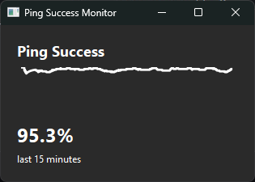

# 1.  Create an isolated environment
py -m venv .venv
.venv\Scripts\activate

# 2.  Install deps
python -m pip install --upgrade pip
pip install -r requirements.txt

# 3.  Launch
python main_matplotlib.py

## Screenshot

