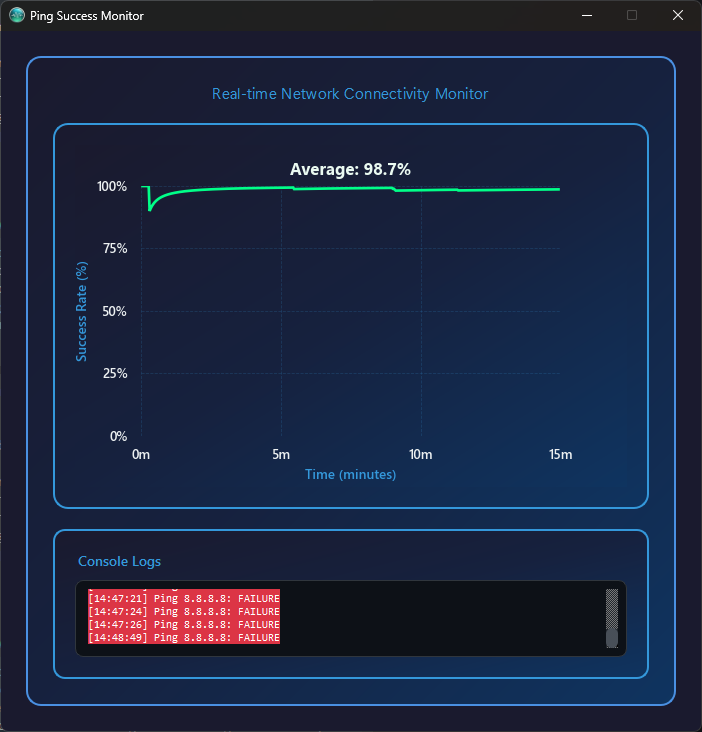

<div align="center">

# Ping Success Monitor

[](https://www.python.org/)
[](https://doc.qt.io/qtforpython/)
[](https://matplotlib.org/)

Real‑time desktop app for visualizing network connectivity by plotting ping success over time.



<p>
  
  
</p>
<p><em>Easily watchdog your internet quality in system tray.</em></p>

<p>
  
  
</p>
<p><em>Easily check your public IP.</em></p>


</div>

---

## Features

- **Live success rate**: Samples connectivity every second and shows a rolling success percentage.
- **Beautiful dark UI**: Modern gradients, readable typography, and a clean chart.
- **Compact console log**: See timestamped ping failures at a glance.
- **Public IP display**: Automatically fetches and displays your public IP address in the system tray tooltip, refreshed every 5 minutes.
- **System tray**: Minimize to tray with Show/Hide/Quit actions.
- **Lightweight**: Single Python script; easy to run on Windows.

## Quickstart (Windows)

```powershell
# 1) Create and activate a virtual environment
py -m venv .venv
.venv\Scripts\activate

# 2) Install dependencies
python -m pip install --upgrade pip
pip install -r requirements.txt

# 3) Run the app (Matplotlib version)
python main_matplotlib.py
```

> Tip: If ping always shows failures, on some systems ICMP may require elevated permissions. Try running your terminal as Administrator.

## Requirements

- Python 3.9+
- Packages (installed via `requirements.txt`):
  - PySide6
  - Matplotlib
  - pythonping
  - SciPy
  - requests

## Usage

- By default the app pings `8.8.8.8` (Google DNS) once per second and updates:
  - A line chart of success rate over the last 15 minutes
  - A large percentage label (average over the window)
  - A compact console listing recent failures

To change the target host, edit the `_default_hosts()` method in `main_matplotlib.py`.

Tray behavior:
- Minimize sends the app to the system tray.
- Close exits the app.
- The tray tooltip shows the current average percentage and your public IP address.
- The tray icon displays the current success rate percentage.
- Right‑click the tray icon for Show/Hide/Quit; double‑click toggles visibility.
- Public IP is fetched on startup and refreshed every 5 minutes using multiple fallback services (echoip.ir, api.ipify.org, icanhazip.com, ifconfig.me/ip).

## Project Structure

```text
ping-success/
  main_matplotlib.py    # Main application (recommended)
  main.py               # Alternate experimental UI (PyQtGraph)
  requirements.txt      # Runtime dependencies
  README.md             # This file
  screen-*.png          # Screenshots
```

## Troubleshooting

- **All pings show FAILURE**:
  - Run the terminal as Administrator (ICMP can require elevated privileges on Windows).
  - Ensure your firewall allows outbound ICMP Echo and inbound Echo Reply.
  - Try a different host, e.g. `1.1.1.1` (Cloudflare DNS).
- **Fonts don’t look right**: Matplotlib will fall back to available system fonts; this is expected.
- **Nothing appears**: Confirm the app is running in the active virtual environment and dependencies installed without errors.

## Roadmap (ideas)

- Multiple targets with per‑host lines
- Export logs/metrics
- Packaged `.exe` via PyInstaller

---

Made with ❤️ for simple, beautiful network monitoring.
